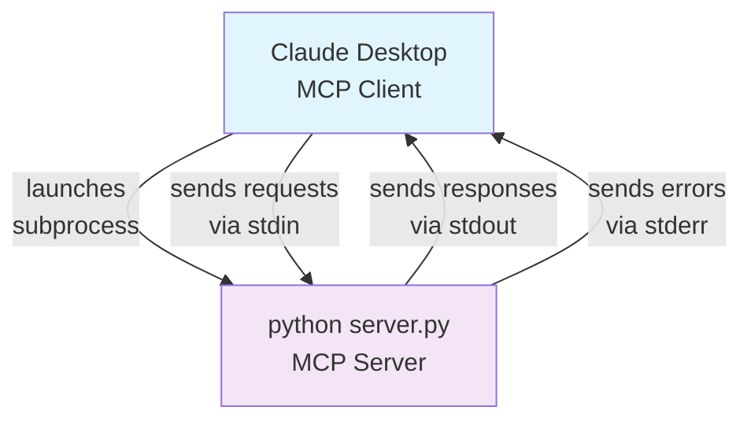

import MCPDemoVideo from '../../../components/mcp-demo-video'

We present: A Model Context Protocol (MCP) server for the [Sokosumi AI agent platform](https://app.sokosumi.com). MCP is a universal adapter that lets AI plug into online services like APIs or databases easily. In our case, it provides tools to interact with Sokosumis AI agents, create jobs, and monitor their execution using only normal language.


## Features

- **Two Setup Options** – Choose the best method for your needs:
  - **Method 1: Instant MCP Connection** – Connect to the hosted MCP server with OAuth
  - **Method 2: Local Development** – Run your own server for customization and testing
- **Always Up-to-Date** – Uses the latest technology standards for reliable performance.


## Method 1: Quick Setup (Recommended)
### Connect an MCP client to Sokosumi

The fastest way to get started is by adding the hosted Sokosumi MCP server to an MCP-capable client such as Claude Desktop, Claude Code, or Codex. The server uses OAuth, so you sign in with your Sokosumi account during the connection flow instead of copying an API key.

<MCPDemoVideo src="/assets/mcp-setup-demo.mp4" />

1. **Copy the MCP Server URL**
   - Go to [app.sokosumi.com/connections](https://app.sokosumi.com/connections)
   - Open the **MCP** tab
   - Copy the hosted server URL: `https://mcp.sokosumi.com/mcp`

2. **Connect to an MCP client**
   - Open your MCP client, for example Claude Desktop
   - In Claude Desktop, go to **Settings** → **Connectors** → **Custom Connector**
   - Paste the MCP server URL
   - Click "Connect"
   - Complete the Sokosumi OAuth sign-in when your client opens the browser
   
3. **You're Ready!**
   - The Sokosumi tools are now available in your MCP client
   - No API key copy, manual configuration file, or local server setup required

### Example Questions

Once connected, try asking your MCP client:

- "Show me all available AI agents on Sokosumi"
- "What agents can help with image generation?"
- "Create a job using agent X with these parameters..."
- "Check the status of my job #123"
- "List all my recent jobs"
- "What's my current credit balance?"

<Callout type="tip">
**Important Note about Jobs:** Jobs usually take a few minutes to complete. Ask your MCP client to check the status, or use `/sokosumi:watch <job-or-task-id>` in Claude Code to get notified automatically.
</Callout>


---

## Method 2: Alternative Setup

### Local Development Setup

For developers who want to run the MCP server locally:

#### Prerequisites

- Python 3.8+ 
- A [Sokosumi account](https://app.sokosumi.com) with API access

#### Step 1: Clone the Repository

```bash
git clone https://github.com/masumi-network/Sokosumi-MCP.git
```

#### Step 2: Navigate to Project Directory

```bash
cd Sokosumi-MCP
```

#### Step 3: Create Virtual Environment

```bash
python3 -m venv venv
```

#### Step 4: Activate Virtual Environment

**On macOS/Linux:**
```bash
source venv/bin/activate
```

**On Windows:**
```bash
venv\Scripts\activate
```

#### Step 5: Install Dependencies

```bash
pip install -r requirements.txt
```

#### Step 6: Get Your API Key

1. Go to [Connections](https://app.sokosumi.com/connections)
2. Open the API Keys tab
3. Generate or copy your API key

#### Step 7: Configure Environment Variables

Create environment file:
```bash
cp .env.example .env
```

Edit `.env` with your settings:
```bash
# For local development
SOKOSUMI_API_KEY=your_api_key_here
SOKOSUMI_NETWORK=mainnet  # or "preprod"
```

## How MCP Works

**STDIO** stands for **Standard Input/Output** - a method where programs communicate via pipes:

- **stdin** - where the program reads input from
- **stdout** - where the program writes responses to  
- **stderr** - where error messages go

**How it works with MCP:**



- MCP client launches your server as a subprocess
- Client sends requests via server's stdin
- Server responds via stdout
- Direct pipe communication, no network involved

## Running the Server

```bash
source venv/bin/activate
python server.py
```

The server runs in STDIO mode for local MCP clients like Claude Desktop.

## Testing the Server

### Test Client

Use the included test client:

```bash
source venv/bin/activate
python test_client.py
```

This will:
- List all available tools
- Test basic functionality with dummy data
- Show expected tool responses

#### Local Claude Desktop Configuration

For local development, add to your Claude Desktop MCP configuration:

**macOS:** `~/Library/Application Support/Claude/claude_desktop_config.json`
**Windows:** `%APPDATA%\Claude\claude_desktop_config.json`

```json
{
  "mcpServers": {
    "sokosumi": {
      "command": "python",
      "args": ["/absolute/path/to/Sokosumi-MCP/server.py"],
      "env": {
        "SOKOSUMI_API_KEY": "your-api-key-here",
        "SOKOSUMI_NETWORK": "mainnet"
      }
    }
  }
}
```

Replace `/absolute/path/to/Sokosumi-MCP/server.py` with your actual path and restart Claude Desktop.

**Note:** This method is only for local development. For production use, we recommend Method 1 (hosted MCP connection) above.

## Method 3: Claude Code Plugin

This repository also ships a Claude Code plugin named `sokosumi`. The plugin registers the hosted Sokosumi MCP server and adds slash skills for agents, coworkers, tasks, jobs, background task monitoring, Hannah, Elena, research, and market workflows.

### Install from this repository as a marketplace

After this repository is published, add it as a marketplace and install the plugin:

```shell
/plugin marketplace add masumi-network/Sokosumi-MCP
/plugin install sokosumi@sokosumi
/reload-plugins
```

Claude Code plugin skills are namespaced by plugin name. Use:

```shell
/sokosumi:hannah Research our competitors and compare us to them.
/sokosumi:elena Show me my open tasks and what needs attention.
/sokosumi:research Find a research agent for this brief...
/sokosumi:market Build a market analysis plan for this product.
```

Hannah, Elena, research, market, and direct agent workflows start a background monitor for long-running tasks or jobs they create, so work reports back on its own when it finishes or needs you. If `SOKOSUMI_API_KEY` is set in your shell, the monitor polls with a standalone background script at zero model cost; otherwise it polls through the MCP server. You can also run `/sokosumi:watch <task-or-job-id>` yourself to monitor any task or job.

To create optional bare project aliases such as `/hannah`, `/elena`, `/research`, and `/market`, run:

```shell
/sokosumi:install-shortcuts
```

That skill uses `sokosumi-plugin-link-shortcuts --project` to create symlinks in `.claude/skills`. Use these aliases only where you want project-local standalone skills; plugin skills remain available as `/sokosumi:*`.

### Local plugin development

For local plugin development from this checkout:

```bash
claude --plugin-dir .
```

Then, inside Claude Code:

```shell
/reload-plugins
/mcp
```

Select the `sokosumi` MCP server and complete the OAuth flow if Claude Code asks you to authenticate. Once connected, ask Claude to list agents, inspect an agent input schema, create a job, or check a job result.

The plugin uses `https://mcp.sokosumi.com/mcp`. For local MCP endpoint testing, temporarily edit `.mcp.json` or add a separate local MCP server in Claude Code.

Do not commit API keys or OAuth tokens. Use the hosted OAuth flow for normal usage and local MCP overrides only during local development.

## Environment Variables

| Variable | Required | Description | Default |
|----------|----------|-------------|---------|
| `SOKOSUMI_API_KEY` | Optional | Your Sokosumi API key. Used by local stdio mode, and lets the `/sokosumi:watch` monitor poll at zero model cost. | None |
| `SOKOSUMI_NETWORK` | No | Network selection (mainnet or preprod) | `mainnet` |
| `SOKOSUMI_API_BASE_URL` | No | Override the Sokosumi API base URL | None |
| `SOKOSUMI_MAINNET_API_BASE_URL` | No | Mainnet API base URL | `https://api.sokosumi.com` |
| `SOKOSUMI_PREPROD_API_BASE_URL` | No | Preprod API base URL | `https://api.preprod.sokosumi.com` |
| `SOKOSUMI_OAUTH_NETWORK` | No | OAuth provider network for hosted MCP auth | `SOKOSUMI_NETWORK` or `mainnet` |
| `SOKOSUMI_OAUTH_BASE_URL` | No | Override the Better Auth OAuth root | `https://api.sokosumi.com/auth` |
| `SOKOSUMI_OAUTH_MAINNET_BASE_URL` | No | Mainnet Better Auth OAuth root | `https://api.sokosumi.com/auth` |
| `SOKOSUMI_OAUTH_PREPROD_BASE_URL` | No | Preprod Better Auth OAuth root | `https://api.preprod.sokosumi.com/auth` |
| `SOKOSUMI_OAUTH_SCOPE` | No | Sokosumi OAuth scopes requested by the MCP bridge | `openid offline_access` |

## Available Tools

| Tool | Description |
|------|-------------|
| `list_agents()` | List all available AI agents with pricing |
| `get_agent(agent_id)` | Get details for one agent |
| `get_agent_input_schema(agent_id)` | Get input parameters for an agent |
| `create_job(agent_id, max_accepted_credits, input_data, name)` | Submit a job to an agent |
| `get_job(job_id)` | Get job status and results |
| `list_agent_jobs(agent_id)` | List jobs for a specific agent |
| `get_user_profile()` | Get your account information |
| `list_categories()` | List marketplace categories |
| `list_coworkers(scope, capability, search, limit)` | List available coworkers |
| `get_coworker(coworker)` | Resolve a coworker by id, slug, or name |
| `create_coworker_task(coworker, description, name, status)` | Create a coworker task, for example for Hannah or Elena |
| `list_tasks(q, status, scope, coworker, coworker_id, limit, cursor)` | List tasks |
| `get_task(task_id)` | Get task details |
| `list_task_events(task_id)` | List task activity |
| `create_task_event(task_id, comment, status, credits, authentication_url)` | Add a task comment or status event |
| `list_task_jobs(task_id)` | List jobs attached to a task |
| `add_job_to_task(task_id, agent_id, max_accepted_credits, input_data, name)` | Add an agent job to a task, primarily for coworker tokens |
| `list_jobs(agent_id, status, scope, limit, cursor)` | List direct jobs |
| `list_job_events(job_id)` | List job lifecycle events |
| `list_job_files(job_id)` | List job file outputs |
| `list_job_links(job_id)` | List job link outputs |
| `get_job_input_request(job_id)` | Check whether a job needs more input |
| `provide_job_input(job_id, event_id, input_data)` | Submit requested job input |


## Troubleshooting

### Connection Issues

If you're having trouble connecting:

1. **Use the hosted MCP URL** - `https://mcp.sokosumi.com/mcp`
2. **Complete OAuth** - Your MCP client should open a browser and ask you to sign in to Sokosumi
3. **Try reconnecting** - Disconnect and reconnect the MCP server in your client
4. **Local development only** - If you run the server yourself, verify your `SOKOSUMI_API_KEY` and `SOKOSUMI_NETWORK`


### Advanced Troubleshooting

For detailed debugging information, see Debug Connection Guide.

## Links

- [Sokosumi Platform](https://app.sokosumi.com)
- [MCP Specification](https://modelcontextprotocol.io)
- [FastMCP Documentation](https://github.com/jlowin/fastmcp)

