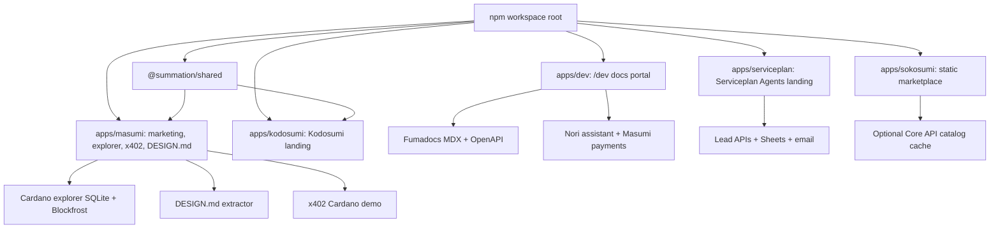
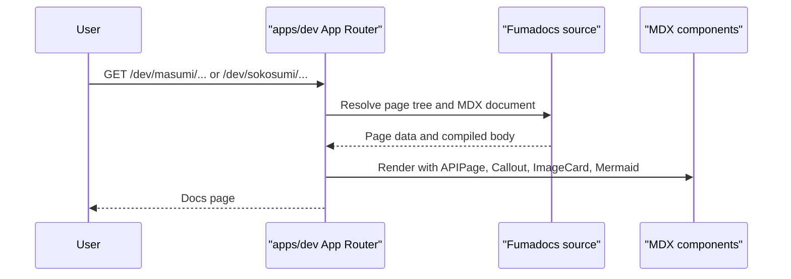
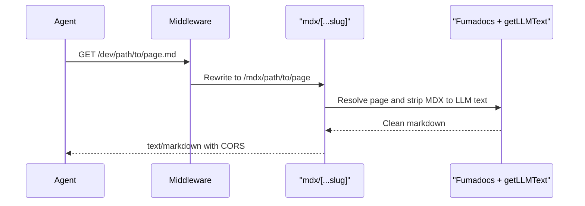
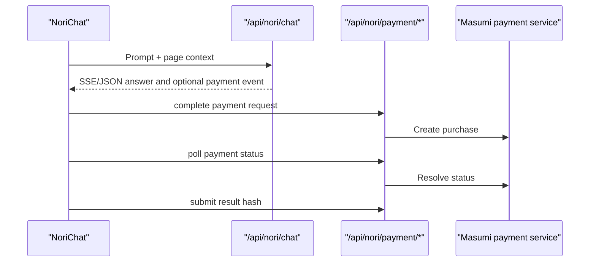
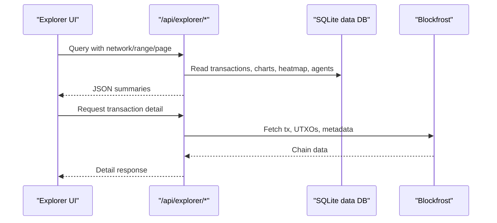
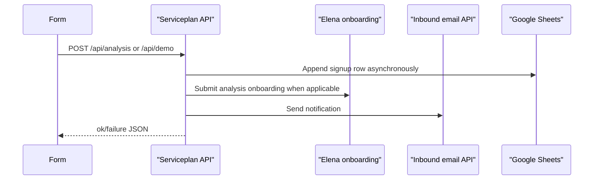
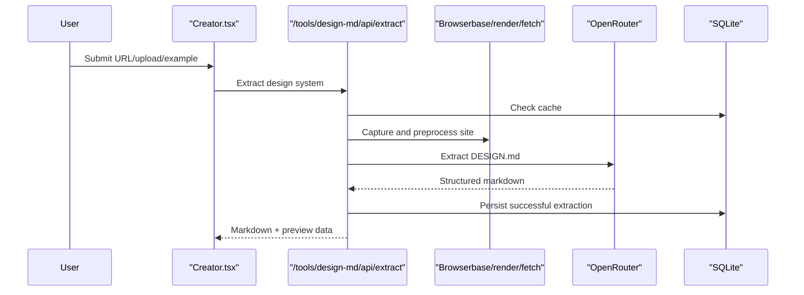

# Codebase Map

> Auto-generated by Cartographer. Last mapped: 2026-07-06T09:17:04Z

## System Overview

This repository is an npm monorepo for Summation/Sokosumi product surfaces. It contains three Next.js apps (`dev`, `masumi`, `kodosumi`), one static Sokosumi marketplace app with a Node server, one Webflow-derived Serviceplan Next app, and a source-compiled shared React component package.

## Directory Structure

| Path | Files | Tokens | Purpose |
| --- | ---: | ---: | --- |
| `apps/dev` | 415 | 266949 | Fumadocs developer portal for Masumi/Sokosumi docs, generated OpenAPI pages, LLM markdown endpoints, and the Nori assistant. |
| `apps/masumi` | 104 | 171849 | Masumi public site, blockchain explorer, blog/content, x402 payment demo, DESIGN.md extraction tool, and discovery APIs. |
| `apps/serviceplan` | 34 | 146646 | Serviceplan Agents landing/demo site with EN/DE localization, Webflow-style UI, lead capture APIs, and Google Sheets/email integrations. |
| `apps/sokosumi` | 5 | 39223 | Static single-file Sokosumi marketplace SPA plus a small Node static server and optional live catalog cache. |
| `apps/kodosumi` | 12 | 19422 | Kodosumi marketing site built with Next App Router and shared product chrome. |
| `packages/shared` | 7 | 7084 | Shared React components: header, footer, reveal animation, and Sokosumi/Summation logo exports. |
| Root config | 5 | 1168 | Workspace scripts, base TypeScript config, ignore rules, and a stale starter README. |

Skipped by scanner: binary AVIF assets in `apps/kodosumi` and `apps/serviceplan`, plus generated/oversized `apps/serviceplan/public/styles/webflow.css` (56195 tokens).

## Module Guide

### Workspace Root

**Purpose**: Private npm workspace for `apps/*` and `packages/*`.

**Entry point**: `package.json`

**Key files**

| File | Purpose | Tokens |
| --- | --- | ---: |
| `package.json` | Root workspace scripts using `npm -w`; aggregate `dev`, `build`, and `lint`. | 409 |
| `tsconfig.base.json` | Shared strict TypeScript defaults with bundler resolution and no emit. | 128 |
| `.gitignore` | Ignores builds, env files, generated data, and caches. | 214 |
| `.railwayignore` | Trims Railway upload payload. | 60 |
| `README.md` | Stale default Next.js starter README, not an accurate monorepo guide. | 357 |

**Dependencies**: npm workspaces; Next/React versions vary per app but are largely Next 16 and React 19.

**Gotchas**: Root `dev` uses shell backgrounding. `build:sokosumi` is a placeholder because `apps/sokosumi` has no real build artifact.

### Dev Portal (`apps/dev`)

**Purpose**: Next App Router developer portal mounted at `basePath: /dev`, combining Fumadocs docs, generated OpenAPI references, LLM-friendly markdown endpoints, and Nori assistant/payment flows.

For a deeper breakdown of this app, see [docs/DEV_HUB_MAP.md](DEV_HUB_MAP.md).

**Entry point**: `apps/dev/app/layout.tsx`, `apps/dev/next.config.mjs`

**Key files**

| File | Purpose | Tokens |
| --- | --- | ---: |
| `apps/dev/app/layout.tsx` | Root provider, font, Plausible scripts, footer, fixed brand imagery. | 445 |
| `apps/dev/app/(portal)/masumi/**` | Masumi docs routes under `/dev/masumi/*`. | 310 |
| `apps/dev/app/(portal)/sokosumi/**` | Sokosumi docs routes under `/dev/sokosumi/*`. | 318 |
| `apps/dev/app/api/nori/chat/route.ts` | Proxies Nori chat, normalizes SSE/JSON, extracts citations and payment events. | 3599 |
| `apps/dev/lib/nori-payment.ts` | Masumi payment identity, session, completion, status, and result submission helpers. | 5485 slice total |
| `apps/dev/components/nori-chat.tsx` | Browser-heavy Nori chat UI, trace phases, payment polling, and custom markdown renderer. | 11121 |
| `apps/dev/app/global.css` | Fumadocs/OpenAPI/Tailwind imports and Nori/product switcher styling. | 23139 |
| `apps/dev/.source/*` | Generated Fumadocs collection manifests. | 30290 |

**Exports / routes**

- `/dev`: Nori home.
- `/dev/masumi/*`, `/dev/sokosumi/*`: docs pages rendered by `ProductDocsPage`.
- `/dev/api/search`: Fumadocs advanced search across both products.
- `/dev/api/page-content?path=...`: raw MDX lookup.
- `/dev/<docs-path>.md`: middleware rewrite to markdown output.
- `/dev/llms.txt`, `/dev/llms-full.txt`, `/dev/md-index`: LLM-oriented indexes.
- `/dev/api/nori/*`: chat, identity, payment completion/status/submit-result.

**Dependencies**: Fumadocs, `fumadocs-openapi`, `lru-cache`, `remark`, `strip-markdown`, Lucide icons, Masumi payment service, optional GitHub token.

**Gotchas**:

- `NEXT_PUBLIC_BASE_PATH` is hardcoded to `/dev`; some CSS asset URLs are also hardcoded to `/dev`.
- `.source/*` is generated by Fumadocs and should not be hand-edited.
- Nori payment sessions are stored in a process-local `Map`, so they are not durable across restarts or multiple instances.
- `scripts/sokosumi/ensure-api-docs.mjs` appears to compute its root under `apps/dev/scripts`, so the predev guard likely checks the wrong paths.
- `source.config.ts` imports `zod` and `unist-util-visit`; verify app-local dependency declarations before dependency pruning.

### Dev Documentation Content

**Purpose**: Product documentation for Masumi and Sokosumi, with shared snippets and generated OpenAPI pages.

**Entry point**: `apps/dev/source.config.ts`, `apps/dev/lib/source.ts`

**Key areas**

| Directory | Purpose | Tokens |
| --- | --- | ---: |
| `apps/dev/content/masumi` | Protocol, node, registry, payments, wallets, MIPs, API docs. | 91333 |
| `apps/dev/content/sokosumi` | Marketplace, tasks/jobs, coworkers, Hermes, CLI, MCP, API docs. | 46874 |
| `apps/dev/content/snippets` | Reusable MDX fragments for ecosystem, Blockfrost, encryption key setup. | 505 |

**Patterns**:

- `meta.json` controls Fumadocs navigation with `title`, `icon`, `root`, separators, and `pages`.
- Masumi generated API docs live under `api-reference/(generated)/payment-service` and `registry-service`.
- Sokosumi generated API docs come from `https://api.sokosumi.com/v1/openapi.json` and are grouped by OpenAPI tag.
- Shared MDX components are wired in `apps/dev/mdx-components.tsx`.

**Gotchas**:

- `**/_*.mdx` is ignored, but several underscore-prefixed docs are intentionally synced/generated and referenced in navigation.
- `get-started/installation.mdx` and `get-started/install-masumi-node.mdx` are near duplicates; navigation points to `install-masumi-node`.
- Some raw Sokosumi docs links are root-relative (`/mcp`, `/api-reference`, `/cli_docs`) and should be checked against the `/sokosumi` base.

### Masumi App (`apps/masumi`)

**Purpose**: Masumi public website with marketing pages, markdown-backed blog, Cardano explorer, x402 demos, DESIGN.md extraction, and machine-readable discovery endpoints.

**Entry point**: `apps/masumi/src/app/layout.tsx`, `apps/masumi/src/app/page.tsx`

**Key files**

| File | Purpose | Tokens |
| --- | --- | ---: |
| `apps/masumi/src/app/page.tsx` | Public homepage composed with shared chrome and client widgets. | 9112 |
| `apps/masumi/src/app/explorer/page.tsx` | Explorer dashboard shell with charts, heatmap, GitHub feed, and transaction table. | included in app total |
| `apps/masumi/src/lib/network-config.ts` | Mainnet/preprod addresses, Blockfrost bases/keys, DB filenames, proxy bases. | included in lib total |
| `apps/masumi/src/lib/explorer-db.ts` | SQLite migrations and explorer query helpers. | included in lib total |
| `apps/masumi/src/lib/x402-facilitator.ts` | Mainnet x402 payment verification, submission, confirmation helpers. | included in lib total |
| `apps/masumi/src/app/tools/design-md/Creator.tsx` | DESIGN.md extraction workflow UI. | 11972 |
| `apps/masumi/src/app/x402/VendingHero.tsx` | x402 explainer and wallet/payment interaction UI. | 14733 |
| `apps/masumi/src/components/ExplorerTransactions.tsx` | Network-aware transaction/agent table and detail expansion. | 7378 component-family slice |

**Exports / routes**

- `/`: marketing homepage.
- `/explorer`: Cardano/Masumi transaction explorer.
- `/blogs`, `/blogs/[slug]`: markdown content.
- `/docs/api`, `/press`, `/imprint`, `/privacy`: static pages.
- `/x402`, `/vending-machine`, `/api/x402/*`: real and demo x402 payment flows.
- `/tools/design-md`, `/tools/design-md/gallery`, `/tools/design-md/api/*`: DESIGN.md extractor and stored outputs.
- `/api/explorer/*`, `/api/masumi-*`, `/api/github-feed`: explorer/homepage data APIs.
- `/.well-known/api-catalog`, `/.well-known/agent-skills/index.json`: machine-readable discovery.

**Dependencies**: Next, React, Tailwind v4, `better-sqlite3`, Blockfrost, Cardano serialization/Mesh packages, Browserbase, Playwright, OpenRouter, Google Sheets, GitHub GraphQL.

**Gotchas**:

- `network-config.ts` contains hardcoded explorer Blockfrost keys and defaults invalid network params to mainnet.
- Script-side `scripts/network-config.mjs` must stay in sync with TS `network-config.ts`.
- Explorer SQLite DBs are created/migrated at runtime under `data/`; generated data is untracked.
- `/vending-machine` uses real mainnet funds; demo v2 is separate under `/api/x402/demo`.
- Sitemap uses `https://masumi.network` while middleware/metadata prefer `www.masumi.network`.
- Some public API and hidden routes require `rg --hidden` to discover.

### Masumi Content, Components, Assets, Scripts

**Purpose**: Blog/news content, reusable landing/explorer components, analytics/consent, and explorer sync scripts.

**Key areas**

| Directory | Purpose | Tokens |
| --- | --- | ---: |
| `apps/masumi/src/components` | Explorer widgets, landing visuals, analytics/consent, GitHub feed. | 31780 |
| `apps/masumi/content` | Announcements, articles, and press releases loaded by `src/lib/blog.ts`. | 9710 |
| `apps/masumi/scripts` | Explorer sync, stats generation, Railway startup wrapper. | 6320 |
| `apps/masumi/public` | `skill.md`, `context7.json`, robots, stats JSON, brand/network assets. | 1836 |

**Patterns**:

- Blog markdown frontmatter uses `title`, `description`, `date`, and `author`; slug is filename.
- Explorer client components fetch JSON endpoints directly and use `?network=preprod` for preprod.
- Consent and analytics are coupled through `CookieConsent`, `GoogleAnalytics`, `useConsent()`, and localStorage key `masumi-cookie-consent`.

**Gotchas**:

- `MasumiStats` is mainnet/default-only and duplicates some explorer UI patterns.
- `VolumeTide` uses a static SVG gradient id, which can collide if rendered multiple times.
- `GitHubCommitFeed` silently hides itself on errors.
- `start-with-sync.mjs` starts Next and sync concurrently; sync failure does not stop the server.

### Serviceplan App (`apps/serviceplan`)

**Purpose**: Serviceplan Agents landing and demo funnel with localized EN/DE copy, Webflow-derived markup/classes, form capture APIs, Google Sheets logging, and notification emails.

**Entry point**: `apps/serviceplan/src/app/layout.tsx`, `apps/serviceplan/src/app/page.tsx`

**Key files**

| File | Purpose | Tokens |
| --- | --- | ---: |
| `apps/serviceplan/src/app/page.tsx` | EN landing page composition. | app slice |
| `apps/serviceplan/src/app/request-a-demo/page.tsx` | Demo form page. | 31134 |
| `apps/serviceplan/src/components/Hero.tsx` | Hero, embedded nav, free-analysis form. | 18182 |
| `apps/serviceplan/src/components/Sokosumi.tsx` | Static dashboard promo with large inline SVG/mock UI. | 39600 |
| `apps/serviceplan/src/lib/translations.ts` | Central EN/DE copy, hrefs, plan data, FAQs, testimonials. | 11721 |
| `apps/serviceplan/src/lib/submitForm.ts` | Browser form helpers and GTM event pushes. | lib slice |
| `apps/serviceplan/src/lib/sheets.ts` | Manual Google service-account JWT and Sheets append. | lib slice |
| `apps/serviceplan/src/app/api/analysis/route.ts` | Free-analysis POST endpoint. | api slice |
| `apps/serviceplan/src/app/api/demo/route.ts` | Demo request POST endpoint. | api slice |

**Exports / routes**

- `/`, `/de`: localized landing pages.
- `/request-a-demo`, `/de/request-a-demo`: localized demo pages.
- `POST /api/analysis`: free-analysis submission.
- `POST /api/demo`: demo request notification.

**Dependencies**: Next, React, Tailwind/CSS, Webflow-style generated CSS, Google Sheets REST, Inbound email API, Elena onboarding API, GTM.

**Gotchas**:

- `public/styles/webflow.css` is very large/generated and linked from the root layout.
- Root `<html lang="en">` also wraps German pages.
- Forms dispatch the global thank-you modal even when API submission fails in several places.
- API routes perform little validation/sanitization.
- Locale switching is route-aware but manually enumerated.
- Webflow class names and generated CSS are tightly coupled; markup class changes can break layout.

### Kodosumi App (`apps/kodosumi`)

**Purpose**: Kodosumi landing site with static marketing/legal pages and shared product chrome.

**Entry point**: `apps/kodosumi/src/app/page.tsx`

**Key files**

| File | Purpose | Tokens |
| --- | --- | ---: |
| `apps/kodosumi/src/app/page.tsx` | Main landing page with static arrays and embedded JSX sections. | 6779 |
| `apps/kodosumi/src/components/VideoModal.tsx` | Client video modal with ESC/backdrop close and YouTube iframe. | app slice |
| `apps/kodosumi/src/app/layout.tsx` | Metadata, Inter font, root layout. | app slice |
| `apps/kodosumi/src/app/imprint/page.tsx` | Static legal imprint. | app slice |
| `apps/kodosumi/src/app/privacy/page.tsx` | Long static privacy page. | 9224 |
| `apps/kodosumi/src/middleware.ts` | Redirects `kodosumi.io` to `www.kodosumi.io`. | app slice |

**Dependencies**: Next, React, Tailwind v4, `@summation/shared`.

**Gotchas**:

- `transpilePackages: ["@summation/shared"]` is required because the shared package exports TS source.
- Privacy copy references cookies/forms/comments/newsletter that are not implemented in the analyzed Kodosumi slice.
- `VideoModal` has no focus trap.

### Sokosumi Static App (`apps/sokosumi`)

**Purpose**: Zero-dependency static Sokosumi marketplace SPA with embedded data and a Node server that can optionally refresh catalog data from a Core API.

**Entry point**: `apps/sokosumi/server.js`, `apps/sokosumi/index.html`

**Key files**

| File | Purpose | Tokens |
| --- | --- | ---: |
| `apps/sokosumi/index.html` | Entire SPA: CSS, JS router, marketplace/coworker/task templates, embedded data. | 32004 |
| `apps/sokosumi/server.js` | Static server, `/api/catalog`, SPA fallback, optional catalog refresher. | 1881 |
| `apps/sokosumi/DESIGN.md` | Product design system/reference. | 5216 |
| `apps/sokosumi/package.json` | `node server.js` dev/start scripts; no real build. | 70 |

**Exports / routes**

- Client routes: `/`, `/marketplace`, `/ai-coworkers/:slug`, `/tasks/:agent/:task`.
- Server route: `/api/catalog`.

**Dependencies**: Node built-ins and global `fetch`; no package dependencies.

**Gotchas**:

- `index.html` currently does not fetch `/api/catalog`.
- `/press` link exists without an implemented route.
- `hero-bg.mp4` is referenced but intentionally gitignored/absent.
- Missing static files fall back to HTML because of SPA fallback.

### Shared Package (`packages/shared`)

**Purpose**: Source-compiled shared React/Next UI primitives for product sites.

**Entry point**: `packages/shared/src/index.ts`

**Key files**

| File | Purpose | Tokens |
| --- | --- | ---: |
| `packages/shared/src/Header.tsx` | Product-aware fixed header with switcher, mobile overlay, optional banner. | shared slice |
| `packages/shared/src/Footer.tsx` | Product-aware footer for Kodosumi, Masumi, and default Sokosumi. | shared slice |
| `packages/shared/src/FadeIn.tsx` | One-shot viewport reveal wrapper. | shared slice |
| `packages/shared/src/SummationLogo.tsx` | Sokosumi/Summation icon and logo exports. | 425 |
| `packages/shared/src/index.ts` | Barrel export for shared components. | 63 |

**Exports**: `Header`, `Footer`, `FadeIn`, `SokosumiIcon`, `SokosumiLogoFull`, `SummationIcon`, `SummationLogoFull`.

**Dependencies**: React, Next `Link`, consuming app public assets.

**Gotchas**:

- No build step; consuming apps compile TS source and must include/transpile this package.
- Header/footer asset paths like `/images/*` must exist in each consuming app.
- `FadeIn` has no reduced-motion handling and renders initially invisible until observed.

## Data Flow

### Dev Docs Rendering

### Dev Markdown And LLM Endpoints

### Nori Payment Flow

### Masumi Explorer

### Serviceplan Lead Capture

### DESIGN.md Extraction

## Conventions

- App-level package scripts use `npm -w <workspace>`.
- Next apps use App Router and mostly Tailwind v4; `apps/serviceplan` preserves Webflow class conventions and generated CSS.
- Shared package exports TS source directly; consuming Next apps transpile it.
- Product docs use Fumadocs `meta.json` navigation and MDX component registration through `apps/dev/mdx-components.tsx`.
- Generated docs and synced content are common; `.source/*`, OpenAPI MDX, synced README docs, and some underscore-prefixed MDX should be treated as generated/synced unless changing the generator.
- Runtime/generated data generally lives under `data/` and is ignored by git.
- Masumi explorer network selection is query-param driven (`?network=preprod`); missing/invalid values default to mainnet.
- Most public API routes that touch native/server packages should explicitly use Node runtime semantics if new routes are added.

## Gotchas

- The root `README.md` is a stale starter file, not a reliable architecture guide.
- `apps/dev` has several base-path-sensitive paths; use `withBasePath()` where available and audit hardcoded `/dev` CSS URLs when changing deployment.
- Nori payment sessions and several caches are in-memory only.
- `apps/dev/scripts/sokosumi/ensure-api-docs.mjs` likely points at the wrong root for predev regeneration.
- `apps/masumi` has duplicated network config between TS and script files.
- Masumi x402 `/vending-machine` is a real mainnet payment path, not only a demo.
- `apps/serviceplan` lead flows can show success UI even if API work fails; API validation is light.
- `apps/serviceplan/public/styles/webflow.css` is oversized/generated and was not fully scanned.
- `apps/sokosumi` exposes `/api/catalog`, but the static HTML does not consume it yet.
- Hidden paths such as `/.well-known/*` require hidden-file search.

## Navigation Guide

**To add a docs page**: Add MDX under `apps/dev/content/masumi` or `apps/dev/content/sokosumi`, update the nearest `meta.json`, then regenerate Fumadocs `.source` through the app build/dev script.

**To add a docs product**: Update `apps/dev/source.config.ts`, `apps/dev/lib/source.ts`, app router product layout/page files, `ProductSwitcher`, and generated `.source`.

**To add an MDX component**: Wire the component in `apps/dev/mdx-components.tsx`; make asset URLs basePath-aware.

**To change Nori chat or payments**: Start with `apps/dev/components/nori-chat.tsx` and `apps/dev/lib/nori-payment.ts`, then update the four `/api/nori/payment/*` route wrappers.

**To change Masumi explorer behavior**: Start in `apps/masumi/src/lib/network-config.ts` and `apps/masumi/src/lib/explorer-db.ts`, then update the relevant `/api/explorer/*` route and client component.

**To add a Masumi network**: Update TS and script network configs, DB filename/config, client `NetworkToggle`, API parsing, Cardanoscan/Blockfrost bases, and sync scripts.

**To change x402 behavior**: Update `apps/masumi/src/lib/x402-facilitator.ts`, `/vending-machine`, `/api/x402/*`, and `apps/masumi/src/app/x402/VendingHero.tsx` together.

**To change DESIGN.md extraction quality**: Work in `apps/masumi/src/app/tools/design-md/lib/preprocess.ts`, `render.ts`, and `llm-extract.ts`; keep public/internal API response shapes and `api/v1/design-md/README.md` aligned.

**To add Masumi blog/news content**: Add a markdown file under `apps/masumi/content/{announcements,articles,press-releases}` with complete frontmatter. Filename becomes slug.

**To change Serviceplan copy**: Start in `apps/serviceplan/src/lib/translations.ts` and verify both `en` and `de`.

**To change Serviceplan forms**: Update the form component, `apps/serviceplan/src/lib/submitForm.ts`, the matching API route, and the Google Sheets row schema.

**To change Serviceplan localization**: Update `LanguageToggle`, middleware matcher/redirect behavior, translated hrefs, and route wrappers under `apps/serviceplan/src/app/de`.

**To change Kodosumi shared chrome**: Update `packages/shared/src/Header.tsx` or `Footer.tsx`, then verify consuming apps have required `/images/*` assets.

**To change Sokosumi static UI**: Edit `apps/sokosumi/index.html`; embedded marketplace data and the client router live in the same file. Wire `server.js` `/api/catalog` separately if live catalog data is needed.
