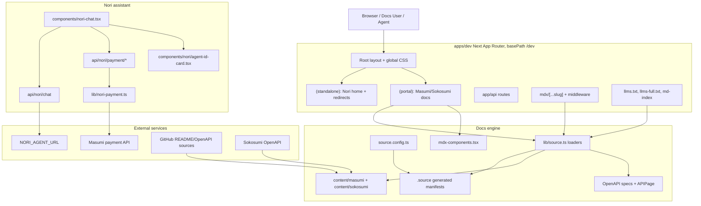
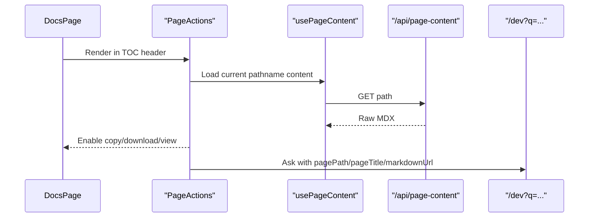
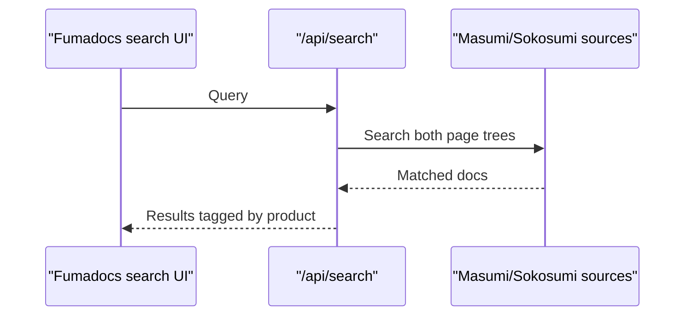
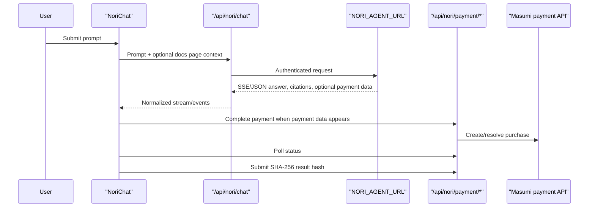
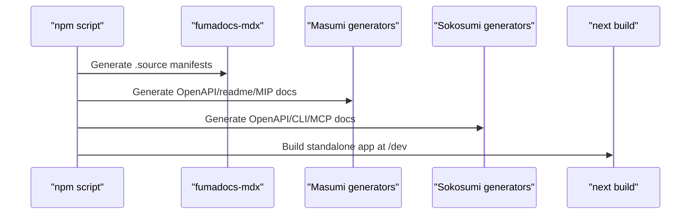
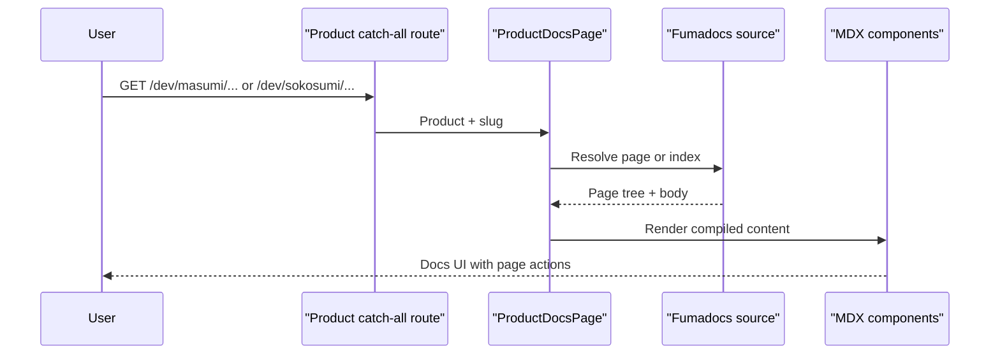
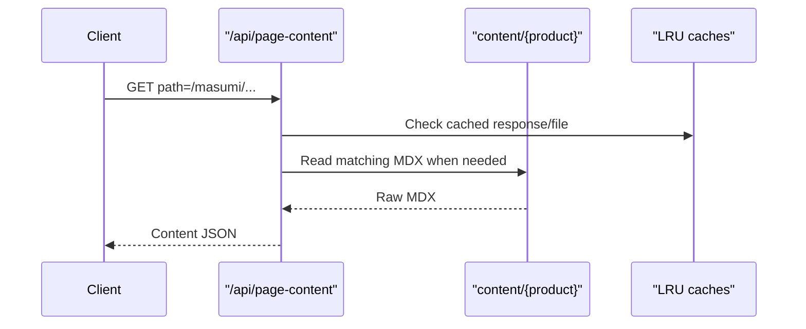
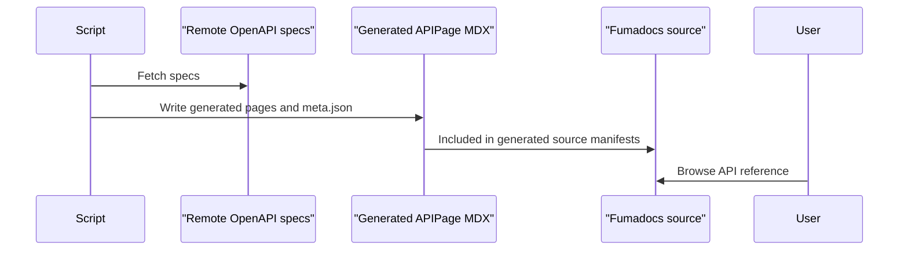
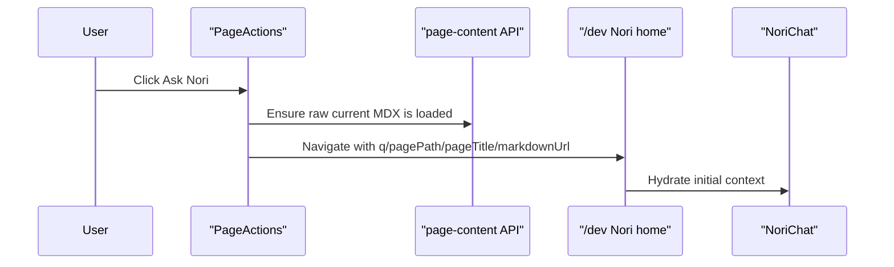

# Dev Hub Map

> Auto-generated by Cartographer. Last mapped: 2026-07-06T09:23:13Z

## Scope

The dev hub is the `apps/dev` Next.js app. It is mounted at `/dev` and serves:

- The Nori assistant landing page.
- Masumi and Sokosumi documentation through Fumadocs.
- Generated OpenAPI API references.
- LLM-oriented markdown endpoints and indexes.
- Page action tooling for copy, download, raw markdown, and "Ask Nori".
- Nori chat APIs and Masumi payment tracing APIs.

Scanner note: scanning from the repo root sees generated/ignored content (`.source`, generated API pages) and reports 415 files / 266949 tokens under `apps/dev`. Scanning `apps/dev` directly reports the working source/content subset, 186 files / 170522 tokens. Both views matter: generated files dominate some runtime behavior but should usually be changed through generators.

## Architecture

## Directory Breakdown

| Path | Files | Tokens | Role |
| --- | ---: | ---: | --- |
| `.source` | 4 | 30290 | Generated Fumadocs manifests for server/browser/dynamic collection loading. Do not hand-edit. |
| `app` | 10 | 29227 | Root layout, global styles, standalone file routes, LLM index route folders, and app-level theme. |
| `app/(portal)` | 4 | 628 | Masumi and Sokosumi docs layouts and catch-all pages. |
| `app/(standalone)` | 4 | 621 | Nori home plus legacy redirects for `/ask` and `/agents`. |
| `app/api` | 7 | 5550 | Search, page-content, and Nori chat/payment API routes. |
| `components` | 14 | 19455 | Product switcher, docs page wrappers, page actions, Nori chat, media helpers. |
| `components/nori` | 1 | 2679 | Agent ID-card UI used by Nori identity/payment display. |
| `components/schema-validator` | 1 | 1826 | Dynamic Masumi schema validator MDX component. |
| `content/masumi` | 112 | 91333 | Masumi docs, concepts, generated Payment/Registry API pages, MIPs, integrations. |
| `content/sokosumi` | 223 | 46874 | Sokosumi docs, CLI/MCP docs, generated API reference grouped by tag. |
| `content/snippets` | 3 | 505 | Shared MDX snippets imported by docs pages. |
| `hooks` | 1 | 335 | Current-page raw-content client hook. |
| `lib` | 6 | 5485 | Base path helpers, caches, source loaders, LLM text extraction, Nori payment state. |
| `public/nori-layout-prototypes` | 7 | 16232 | Static design prototypes, not active runtime. |
| `scripts` | 3 | 8083 | Masumi OpenAPI generation and README/MIP sync scripts. |
| `scripts/sokosumi` | 5 | 3715 | Sokosumi OpenAPI, CLI, MCP, and README fetch/generation scripts. |
| Config files | 10 | 4110 | Package, Next, TS, PostCSS, middleware, Fumadocs source config, README. |

## Runtime Route Map

| Route | File(s) | Purpose |
| --- | --- | --- |
| `/dev` | `app/(standalone)/page.tsx` | Nori assistant home. Accepts `q`, `pagePath`, `pageTitle`, and `markdownUrl` search params. |
| `/dev/ask` | `app/(standalone)/ask/page.tsx` | Legacy redirect to `/dev`, preserving query params. |
| `/dev/agents` | `app/(standalone)/agents/page.tsx` | Redirects to `/dev/masumi/documentation`. |
| `/dev/masumi/*` | `app/(portal)/masumi/layout.tsx`, `app/(portal)/masumi/[[...slug]]/page.tsx` | Masumi docs rendered through `ProductDocsPage`. |
| `/dev/sokosumi/*` | `app/(portal)/sokosumi/layout.tsx`, `app/(portal)/sokosumi/[[...slug]]/page.tsx` | Sokosumi docs rendered through `ProductDocsPage`. |
| `/dev/api/search` | `app/api/search/route.ts` | Fumadocs advanced search over both products, tagged by product. |
| `/dev/api/page-content?path=...` | `app/api/page-content/route.ts` | Raw MDX lookup for current page actions and Nori context. |
| `/dev/<docs-path>.md` | `middleware.ts`, `app/mdx/[...slug]/route.ts` | `.md`/`.markdown` rewrite to cleaned markdown response. |
| `/dev/llms.txt` | `app/llms.txt/route.ts` | Compact LLM index. |
| `/dev/llms-full.txt` | `app/llms-full.txt/route.ts` | Full LLM text dump with 24h memory cache and opportunistic file cache. |
| `/dev/md-index` | `app/md-index/route.ts` | Markdown page index. |
| `POST /dev/api/nori/chat` | `app/api/nori/chat/route.ts` | Proxies Nori agent responses, supports SSE/JSON normalization, citation extraction, and payment events. |
| `/dev/api/nori/identity` | `app/api/nori/identity/route.ts` | Thin identity route around `lib/nori-payment.ts`. |
| `/dev/api/nori/payment/complete` | `app/api/nori/payment/complete/route.ts` | Starts/completes Masumi purchase flow. |
| `/dev/api/nori/payment/status` | `app/api/nori/payment/status/route.ts` | Polls Masumi payment status. |
| `/dev/api/nori/payment/submit-result` | `app/api/nori/payment/submit-result/route.ts` | Submits SHA-256 result hash after completion. |

## Module Guide

### App Shell And Base Path

**Purpose**: Provide app-wide Fumadocs UI, global styling, metadata, analytics scripts, product shell, and `/dev` deployment assumptions.

**Key files**

| File | Purpose |
| --- | --- |
| `app/layout.tsx` | Root HTML shell, Inter font, RootProvider, Plausible scripts, footer, fixed Kanji assets. |
| `app/layout.config.tsx` | Shared layout configuration. |
| `app/global.css` | Tailwind/Fumadocs/OpenAPI imports, docs overrides, product switcher, Nori stage/chat/ID-card CSS. |
| `app/masumi-theme.css` | Fumadocs theme variables and sidebar overrides. |
| `next.config.mjs` | `basePath: /dev`, MDX plugin, standalone output, Turbopack root, cache headers, legacy redirects. |
| `lib/base-path.ts` | `basePath`, `siteOrigin`, `portalUrl`, and `withBasePath()` helpers. |

**Important dependencies**: `NEXT_PUBLIC_BASE_PATH`, `NEXT_PUBLIC_SITE_URL`, Fumadocs UI, Next static asset behavior.

**Gotchas**:

- `NEXT_PUBLIC_BASE_PATH` is hardcoded to `/dev` in Next config.
- `withBasePath()` does not alter relative paths or protocol-relative URLs.
- Some CSS URLs are hardcoded to `/dev`, including the Nori ID-card watermark path.
- `app/global.css` contains both older `.nori-*` and current `.nori-stage` styles.

### Docs Source And Rendering

**Purpose**: Load two product documentation trees and render them with shared MDX components and OpenAPI support.

**Key files**

| File | Purpose |
| --- | --- |
| `source.config.ts` | Defines `masumiDocs` and `sokosumiDocs`; extends frontmatter with optional `banner`; configures Mermaid remark support. |
| `.source/server.ts` | Generated server-side Fumadocs manifest for all configured docs. |
| `.source/browser.ts` | Generated browser collection support. |
| `.source/dynamic.ts` | Generated invocation glue. |
| `lib/source.ts` | Builds `masumiSource`, `sokosumiSource`, product source map, page lookup helpers, OpenAPI plugin config. |
| `components/product-docs-page.tsx` | Resolves docs slug/index, handles product-root redirects, renders MDX body, generates metadata. |
| `components/custom-docs-page.tsx` | Wraps Fumadocs `DocsPage` and injects page actions into the TOC header. |
| `mdx-components.tsx` | Registers Fumadocs components, OpenAPI `APIPage`, Lucide icons, custom media/card/banner/schema/Mermaid components. |

**Dependents**: Product docs routes, search route, markdown route, LLM routes, page actions, and Nori context flow.

**Gotchas**:

- `.source/*` is generated; run the app build/dev generation path rather than editing it.
- `ProductSource` is typed from `masumiSource` and reused structurally for Sokosumi.
- OpenAPI spec sources are mixed: Masumi payment is pinned to a commit, registry uses `main`, and Sokosumi uses live `https://api.sokosumi.com/v1/openapi.json`.
- `img` rendering is basePath-aware via `ImageZoom`; `Banner` is not.
- `source.config.ts` imports `zod` and `unist-util-visit`; verify dependency declarations before cleanup.

### Product Content

**Purpose**: Hold navigable docs content and generated/synced docs for both products.

**Masumi docs**

| Area | Purpose |
| --- | --- |
| `content/masumi/documentation` | Product intro, get-started, how-to, integrations, technical docs. |
| `content/masumi/core-concepts` | Payments, identity, registry, wallets, UTXO, tokens, compliance, disputes, decision logging. |
| `content/masumi/api-reference` | Generated Payment Service and Registry Service API pages. |
| `content/masumi/mips` | Masumi Improvement Proposals and attachments. |
| `content/masumi/n8n-node` | n8n node docs. |

**Sokosumi docs**

| Area | Purpose |
| --- | --- |
| `content/sokosumi/documentation` | Overview, projects, history, coworkers, organization, Hermes, image generation. |
| `content/sokosumi/api-reference` | Generated API docs grouped by OpenAPI tags such as agents, jobs, tasks, users, organizations, Hermes. |
| `content/sokosumi/cli_docs` | Fetched CLI README/docs. |
| `content/sokosumi/mcp` | Fetched MCP docs and debugging notes. |

**Shared snippets**

| File | Purpose |
| --- | --- |
| `content/snippets/ecosystem.mdx` | Shared Masumi/Sokosumi/Kodosumi ecosystem cards. |
| `content/snippets/get-blockfrost-api-key.mdx` | Reusable Blockfrost API key setup accordion. |
| `content/snippets/generate-encryption-key.mdx` | Reusable encryption key generation accordion. |

**Gotchas**:

- Several underscore-prefixed MDX files are intentionally synced/generated and referenced, despite ignore patterns.
- `get-started/installation.mdx` and `get-started/install-masumi-node.mdx` are near duplicates; navigation points to `install-masumi-node`.
- Some Sokosumi docs links appear root-relative and should be checked against the `/sokosumi` base URL.

### LLM And Markdown Surface

**Purpose**: Expose docs as cleaned markdown and machine-readable indexes for agents and external tools.

**Key files**

| File | Purpose |
| --- | --- |
| `middleware.ts` | Rewrites `.md` and `.markdown` requests to internal markdown route. |
| `app/mdx/[...slug]/route.ts` | Resolves docs pages and returns cleaned markdown with CORS headers. |
| `app/llms.txt/route.ts` | Builds compact LLM index. |
| `app/llms-full.txt/route.ts` | Builds full docs text output and writes `.cache/llms-full.txt` opportunistically. |
| `app/md-index/route.ts` | Emits markdown URL index. |
| `lib/get-llm-text.ts` | Converts MDX content into LLM-friendly text with remark/strip-markdown and regex cleanup. |
| `lib/cache.ts` | Provides in-memory LRU caches for file reads, API responses, and LLM text. |

**Gotchas**:

- `getLLMText()` is optimized for readable text, not lossless markdown preservation.
- LLM routes use in-memory 24h caches; only `llms-full` has opportunistic file caching.
- Middleware only handles docs-like markdown URL rewrites; it does not make all app pages markdown-aware.

### Page Actions

**Purpose**: Provide docs-page utilities for copy, view raw markdown, download, and "Ask Nori".

**Key files**

| File | Purpose |
| --- | --- |
| `components/page-actions.tsx` | Client UI and action logic for copy/view/download/Ask Nori. |
| `components/page-actions-wrapper.tsx` | Injects actions into docs layout. |
| `hooks/use-page-content.ts` | Fetches raw MDX for the current docs path. |
| `app/api/page-content/route.ts` | Raw MDX source endpoint with path traversal rejection and cache use. |

**Flow**:

**Gotchas**:

- Actions disable themselves if raw content fetch fails.
- Markdown URL uses window origin on the client and `portalUrl` as server fallback.

### Search

**Purpose**: Search across both product docs.

**Key file**: `app/api/search/route.ts`

**Flow**:

**Gotchas**: Generated docs are searchable if present in the Fumadocs source manifests.

### Nori Chat And Payment

**Purpose**: Let users ask Nori questions from the home page or a docs page, then trace citations and optional Masumi payment events.

**Key files**

| File | Purpose |
| --- | --- |
| `components/nori-chat.tsx` | Main client chat UI, stream parser, trace visualization, payment polling, SHA-256 result hash. |
| `components/nori/agent-id-card.tsx` | Agent identity card with pointer tilt, MRZ lines, registry state, and stamp animation. |
| `app/api/nori/chat/route.ts` | Proxies to `NORI_AGENT_URL`; normalizes Vercel AI stream, SSE, and JSON response variants. |
| `lib/nori-payment.ts` | Payment types, `NoriPaymentError`, identity lookup, process-local session store, complete/status/submit helpers. |
| `app/api/nori/identity/route.ts` | Identity wrapper around payment lib. |
| `app/api/nori/payment/complete/route.ts` | Creates/completes purchase flow. |
| `app/api/nori/payment/status/route.ts` | Polls status. |
| `app/api/nori/payment/submit-result/route.ts` | Submits final result hash. |

**Flow**:

**Environment variables**:

| Variable | Purpose |
| --- | --- |
| `NORI_AGENT_URL` | Upstream Nori agent endpoint. |
| `COWORKERS_API_KEY` or `NORI_AGENT_API_KEY` | Auth for upstream Nori agent. |
| `MASUMI_PAYMENT_API_URL` | Masumi payment service base URL. |
| `MASUMI_PAYMENT_API_KEY` | Masumi payment service API key. |
| `MASUMI_NETWORK` | Defaults to `Preprod`. |

**Gotchas**:

- Payment sessions are process-local and not durable across restarts or horizontally scaled instances.
- `usage` appears in phase logic but not in the active trace phase list.
- The markdown renderer in `nori-chat.tsx` is a small custom subset, not the docs MDX renderer.
- Payment field expectations are exact; malformed upstream payment events can break the payment path.

### MDX Helper Components

| Component/file | Purpose | Gotchas |
| --- | --- | --- |
| `components/mermaid.tsx` | Dynamic Mermaid rendering with theme awareness and `securityLevel: loose`. | Chart ref can prevent re-render on theme change if chart text is unchanged. |
| `components/schema-validator/schema-validator.tsx` | Dynamically imports Masumi schema validator component with SSR disabled. | Large hardcoded examples; theme is derived from document class via observer. |
| `components/image-card.tsx` | Reusable docs image-card layout. | Asset paths depend on caller. |
| `components/banner.tsx` | Banner rendering from frontmatter. | Does not use `withBasePath()`. |
| `components/copy-cell.tsx` | Copyable table/cell helper. | Client clipboard dependency. |
| `components/mcp-demo-video.tsx` | Embedded media helper for MCP demo. | Browser/media surface only. |
| `components/github-readme.tsx` | Fetch/display GitHub README content. | Accepts `branch` but does not use it in the GitHub API URL. |
| `components/agents-hub.tsx` | Machine-readable endpoint cards and copy buttons. | No active route renders it; `/agents` redirects away. |

### Product Switcher

**Key file**: `components/product-switcher.tsx`

**Purpose**: Brand dropdown for Nori, Masumi, and Sokosumi inside the Fumadocs title area.

**Dependencies**: `next/image`, `next/link`, product menu state, outside-click/escape handling, `lib/last-product.ts`.

**Gotchas**:

- It prevents default navigation because it is rendered inside a Fumadocs title link.
- Menu position is recalculated manually on scroll and resize.
- `last-product.ts` only knows `masumi` and `sokosumi`; SSR default is `masumi`.

### Generation Scripts

| File | Purpose | Gotchas |
| --- | --- | --- |
| `scripts/generate-openapi.mjs` | Generates Masumi Payment/Registry API MDX and `meta.json` under `content/masumi/api-reference/(generated)`. | Top-level `.catch()` logs but does not force `process.exit(1)`. |
| `scripts/fetch-readme.mjs` | Syncs Masumi READMEs, MIPs, images, JSX conversions, and static Railway page. | Regex-heavy conversion; optional `GITHUB_TOKEN`; top-level catch logs without failing. |
| `scripts/generate-llms-txt.ts` | Auxiliary build-time full `public/llms.txt` generator. | Not wired into main build; route-based `/llms.txt` is the active surface. |
| `scripts/sokosumi/generate-openapi.mjs` | Generates Sokosumi API docs from live OpenAPI and groups by tag. | Exits nonzero on failure. |
| `scripts/sokosumi/ensure-api-docs.mjs` | Intended predev guard for missing generated Sokosumi API pages. | Likely broken path root; appears to check under `apps/dev/scripts/content`. |
| `scripts/sokosumi/generate-cli-docs.mjs` | Fetches Sokosumi CLI README docs. | Image path rewriting is incomplete. |
| `scripts/sokosumi/generate-mcp-docs.mjs` | Fetches Sokosumi MCP docs. | Image syncing is commented out. |
| `scripts/sokosumi/fetch-readme.mjs` | Sokosumi README fetch helper. | Treat as synced-doc tooling. |

**Build path**:

### Public Assets And Prototypes

| Area | Purpose |
| --- | --- |
| `public/assets` | Logos, Kanji marks, Nori profile image, banners, docs screenshots, wallet/payment diagrams, GIF/video demos. |
| `public/synced-images` | Generated/synced README media. |
| `public/favicon-docs.svg` | Docs favicon. |
| `public/nori-layout-prototypes` | Static HTML/CSS/JS Nori design studies, not active app runtime. |

**Gotchas**:

- Public asset paths need `/dev` handling when used in runtime CSS/JS.
- Synced images are generated outputs and may be overwritten by scripts.

## Cross-Cutting Data Flows

### Docs Page Render

### Raw Page Content

### OpenAPI Docs

### Ask Nori From Docs

## Environment And Configuration

| Name | Used by | Notes |
| --- | --- | --- |
| `NEXT_PUBLIC_BASE_PATH` | Next config, client helpers | Set to `/dev` by config. |
| `NEXT_PUBLIC_SITE_URL` | URL helpers, markdown links | Defaults to `https://www.masumi.network`. |
| `PORT` | Next start | App package controls dev/start port. |
| `GITHUB_TOKEN` | README/docs fetch scripts | Optional but useful for rate limits/private access. |
| `NORI_AGENT_URL` | Nori chat API | Required for live assistant. |
| `COWORKERS_API_KEY` | Nori chat API | Preferred upstream auth key. |
| `NORI_AGENT_API_KEY` | Nori chat API | Alternate upstream auth key. |
| `MASUMI_PAYMENT_API_URL` | Nori payment lib | Required for live payments. |
| `MASUMI_PAYMENT_API_KEY` | Nori payment lib | Required for live payments. |
| `MASUMI_NETWORK` | Nori payment lib | Defaults to `Preprod`. |

## Generated File Policy

- Treat `.source/*` as generated Fumadocs manifests.
- Treat `content/*/api-reference/(generated)` and most generated Sokosumi API folders as script output.
- Treat `public/synced-images` as synced media output.
- If generated docs look stale, run or fix the relevant script rather than editing pages one by one.

## Known Gotchas

- `apps/dev` is base-path sensitive. Changing `/dev` requires auditing `next.config.mjs`, `lib/base-path.ts`, generated URLs, markdown URLs, public asset references, and hardcoded CSS paths.
- Nori payment state is in-memory only.
- `app/api/nori/chat/route.ts` handles multiple response shapes; changes should preserve SSE, Vercel AI stream, JSON, citations, and payment events.
- `getLLMText()` uses broad cleanup and is not a reversible MDX transform.
- `scripts/sokosumi/ensure-api-docs.mjs` likely checks the wrong path root.
- `GitHubReadme` accepts a branch prop but does not use it in the GitHub API URL.
- `Mermaid` uses `securityLevel: loose`.
- `Banner` is not basePath-aware.
- `AgentsHub` appears unused because `/agents` redirects.

## Navigation Guide

**To add a Masumi docs page**: Add MDX under `content/masumi`, update the nearest `meta.json`, regenerate `.source`, then verify `/dev/masumi/...`, `.md`, search, and LLM output.

**To add a Sokosumi docs page**: Add MDX under `content/sokosumi`, update `meta.json`, regenerate `.source`, then verify `/dev/sokosumi/...` and any root-relative links.

**To update generated API docs**: Change the appropriate generator under `scripts/` or `scripts/sokosumi/`, run it, then regenerate Fumadocs `.source`.

**To add a global MDX component**: Add/import the component and register it in `mdx-components.tsx`; audit asset paths for `/dev`.

**To change the docs page layout**: Start in `components/product-docs-page.tsx`, `components/custom-docs-page.tsx`, and the product layout under `app/(portal)`.

**To change page actions**: Update `components/page-actions.tsx`, `hooks/use-page-content.ts`, and `app/api/page-content/route.ts` together.

**To change markdown output**: Update `app/mdx/[...slug]/route.ts` and `lib/get-llm-text.ts`; verify `.md`, `llms.txt`, `llms-full.txt`, and `md-index`.

**To change Nori chat UI**: Work in `components/nori-chat.tsx` and `components/nori/agent-id-card.tsx`; verify streaming, citations, payment event rendering, and page-context prompts.

**To change Nori agent proxying**: Work in `app/api/nori/chat/route.ts`; preserve upstream auth, SSE/JSON normalization, and payment extraction.

**To change Nori payment behavior**: Work in `lib/nori-payment.ts` first, then adjust `api/nori/payment/complete`, `status`, `submit-result`, and the chat UI payment polling.

**To add a new product to the dev hub**: Update `source.config.ts`, `lib/source.ts`, product routes under `app/(portal)`, product navigation in `components/product-switcher.tsx`, docs content, and generation scripts.

**To change `/dev` deployment path**: Update `next.config.mjs`, `lib/base-path.ts`, public/CSS asset references, markdown URL generation, and any externally documented dev portal URLs.
